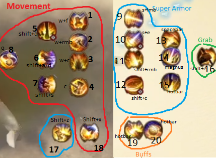
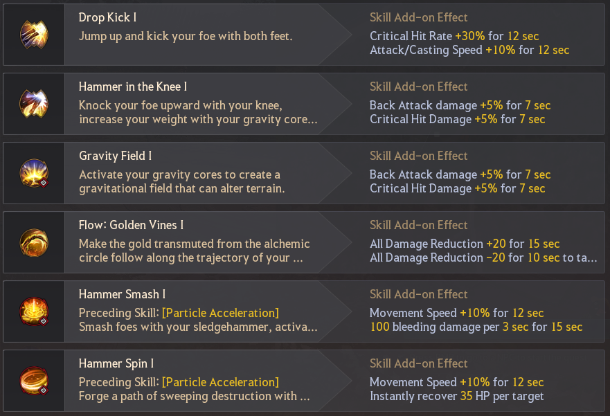
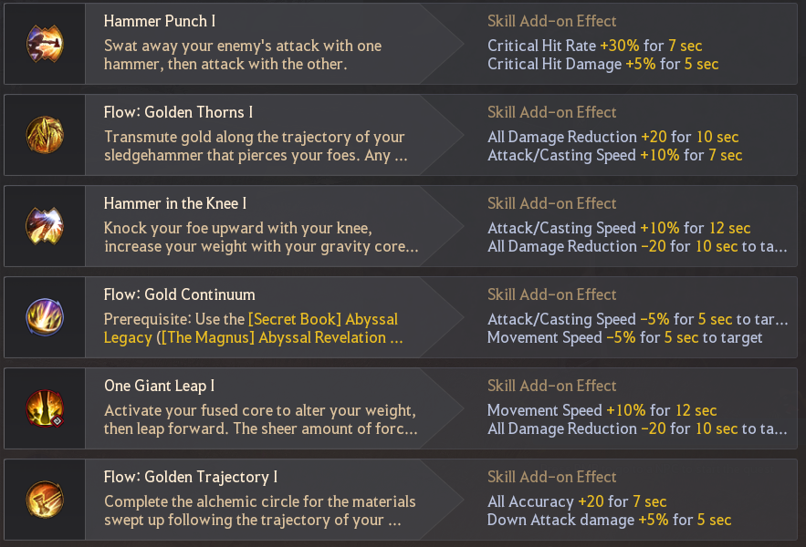

## Matrix's Scholar Notes

#### Core: Hammer Smash

#### Lock
- Awakening
	- Flow: Golden Blockade V
- BSR
	- Absolute: Potential Energy
#### Skill Enhancement
- Gravity Rush
- Golden Path
- Golden Boon
#### Hotbar
- 1 -> Flow: Repulsion (lmb after certain skills)
- 2 -> Absolute: Gravity Press (main skill)
- 4 -> Golden Boon (skill enhancement)
- 5 -> Particle Acceleration (main skill)
- 6 -> Whale Tendon Potion

#### Skill Cooldown Slots
- 1 -> One Small Step (w+f)
- 2 -> Hammerdown (w+rmb)
- 3 -> Hammer Rush (w+c)
- 4 -> Core Fusion (c)
- 5 -> One Giant Leap (shift+q)
- 6 -> Gravity Blink (shift+a/d/w)
- 7 -> Reversal (shift+s)
- 8 -> Gravity Anchor (q)
- 9 -> Home Run (s+lmb)
- 10 -> Potential Energy (s+e)
- 11 -> Infinite Power (shift+rmb)
- 12 -> Hammer Spin (shift+c)
- 13 -> Golden Thunder (space after skills)
- 14 -> Gold Continuum (lmb after q or hold s+lmb after s+lmb)
- 15 -> Repulsion (lmb after certain skills, hotbar 1)
- 16 -> Gravity's Grip (shift+e)
- 17 -> Golden Path (shift+z)
- 18 -> Gravity Rush (shift+x)
- 19 -> Golden Boon (hotkey 4)
- 20 -> Particle Acceleration (hotkey 5)

#### Skill Add-ons
##### PvE

##### PvP - 1v1

##### PvP - NodeWar

#### Movement
- w+c > c
- shift+q
- w+f
- w+rmb > (hold) rmb
- shift+a/d/w
- shift+s x2
- q x2
#### CC's
- Knockdown
	- Drop Kick (f)
	- Golden Blockade (e after hammer in the Knee (w+e))
	- Golden Thunder (spacebar)
- Stiffness
	- Hammer Throw (s+f)
	- Gravity Rush (shift+x)
- Knockback
	- Attraction (2nd q)
- Floating
	- Golden Pillar (rmb after hammer strike (rmb))
- Grapple - Gravity's Grip (shift+e)
#### Utility
- Ignore Movespeed Down
	- Golden Boon (hotbar rabam)
- HP Recovery on hit
	- Hammer Spin (shift+c)
	- Golden Thunder (spacebar)
	- Hammerfall (shift+f)
	- Golden Trajectory (e after Hammer Punch (e))
	- Golden Wave (s+rmb after Gravity Field (s+rmb))
	- Golden Path (shift+z)
- DP Down 
	- Golden Vines (hold f after dropkick (f))
	- Hammer Smash (shift+lmb)
- Melee AP 
	- Hammer Punch (e)
- Attackspeed
	- Hammer in the Knee (w+e)
	- Gravity Anchor (q)
- Evasion Down
	- Hammerfall (shift+f)
- Damage Reduction 
	- One Small Step (w+f)
	- Core Fusion (c)
- Movespeed & Attack/Casting speed down
	- Gravity Distortion (hotbar rabam)
- Attack/Casting speed down 
	- Potential Energy (s+e)
- Nullifying Defense Buff - Sledgehammer Skills
- Jump Height
	- One Small Step (w+f)
	- Gravity Field (s+rmb)
	- Gravity Press (have to hotbar)
	- Potential Energy (s+e)
	- Hammer throw (s+f)
	- Gravity Crush (shift+x)
	- Gravity Distortion (rabam hotbar)
#### Combos
- Pre-buff
	- w+e > e > (hold) e > (optional for dr) w+f
- PvE
	- f > (hold) f > e > w+e > (hold) e > shift+lmb > s+rmb (hold) > s+f (hold) > shift+f > shift+c > repeat
- PvP
	- NodeWar
		- Engage - shift+q > space > shift+c > s+e > s+lmb > lmb > space > gtfo
	- 1v1
		- shift+e (grab) > w+e > (hold) e > shift+lmb > c > s+lmb > space > shift+rmb/shift+c
  - more combos todo
#### Notes
- Cancels
	- Make sure you have spacebar or c to cancel out of Hammer Spin (shift+c)
		- You can bait grabs in shift+c and instantly spacebar to iframe it and possibly kd
	- Always cancel out of the end of the magnus with c, it's too slow otherwise
	- Hammer Smash (shift+lmb) second half for a quick catch attempt, can also cancel with a backdash
	- shift+q over someones head and canceling with spacebar while turning your camera 180 can disorient people
- Misc Tips
	- Careful with holding s+lmb, you're really easy to grab out of it and esp if you hold it for magnus
	- Put repulsion on hotbar so you can use it to take out weaps
- Movement
	- If you randomly get a cc but are too far away you can Gravity Rush (shift+x) to close distance and possibly stiff
	- You can camera turn the second half of Hammer Rush (w+c)
- Lingers and SA
	- You can linger shift+s for a longer iframe
	- s+f (hold) is unprot at the start buff but lingers a long time
	- Can hold shift+rmb to stall in SA, weave and rotate through s+e, shift+c, shift+s, shift+z and s+lmb
