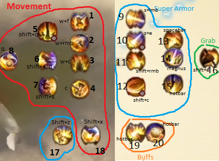
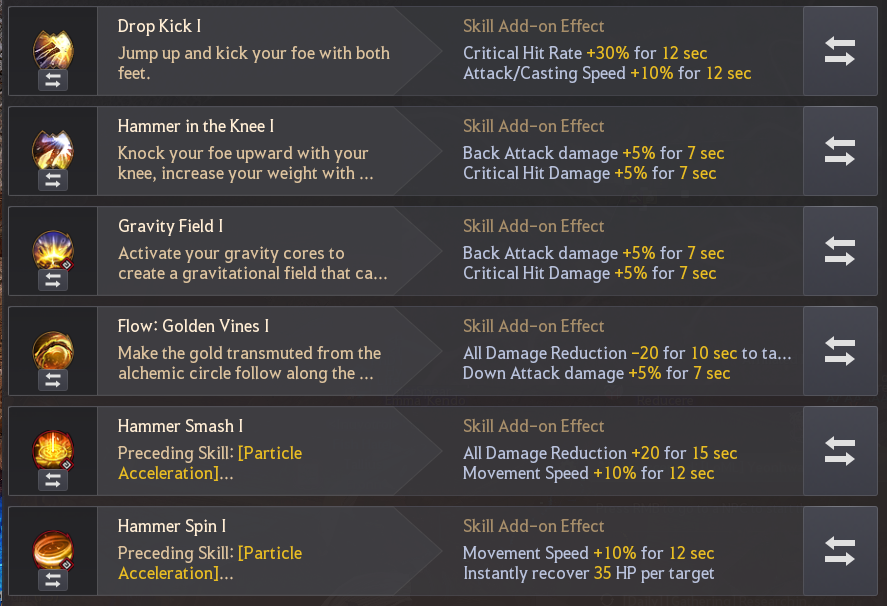
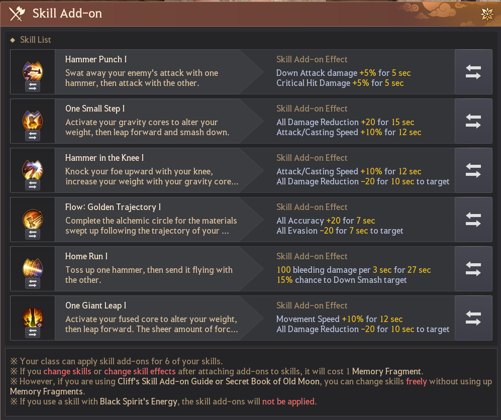
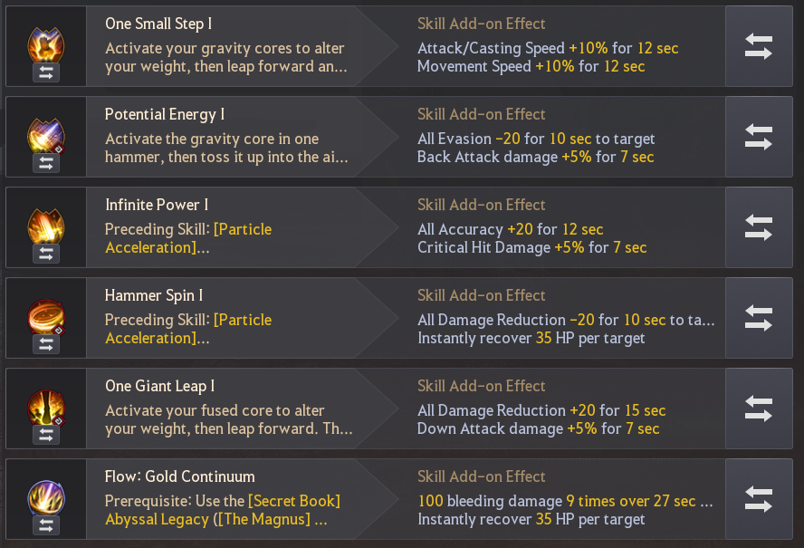

# [Matrix's Scholar Notes](https://github.com/MatrixAlgebra/scholar-notes)

# Last Updated: 9-5-2026
## Core: Hammer Smash
- Hammerfall is new and ok
- Hammer spin is a meme
- Everything else sucks

## Lock
- Awakening
	- Flow: Golden Blockade V
- BSR
	- Absolute: Potential Energy
- Evasion

## Skill Enhancement
- Gravity Rush
- Golden Path
- Golden Boon
## Hotbar
- 1 -> Flow: Repulsion (lmb after certain skills)
- 2 -> Absolute: Gravity Press (main skill)
- 4 -> Golden Boon (skill enhancement)
- 5 -> Particle Acceleration (main skill)
- 6 -> Whale Tendon Potion
## Skill Cooldown Slots
- 1 -> One Small Step (w+f)
- 2 -> Hammerdown (w+rmb)
- 3 -> Hammer Rush (w+c)
- 4 -> Core Fusion (c)
- 5 -> One Giant Leap (shift+q)
- 6 -> Gravity Blink (shift+a/d/w)
- 7 -> Reversal (shift+s)
- 8 -> Gravity Anchor (q)
- 9 -> Home Run (s+lmb)
- 10 -> Potential Energy (s+e)
- 11 -> Infinite Power (shift+rmb)
- 12 -> Hammer Spin (shift+c)
- 13 -> Golden Thunder (space after skills)
- 14 -> Gold Continuum (lmb after q or hold s+lmb after s+lmb)
- 15 -> Repulsion (lmb after certain skills, hotbar 1)
- 16 -> Gravity's Grip (shift+e)
- 17 -> Golden Path (shift+z)
- 18 -> Gravity Rush (shift+x)
- 19 -> Hammer Smash (shift+lmb)
- 20 -> Hammerfall (shift+f)

![[skill_ui_guide.png]]

## Skill Add-ons
### PvE

![[scholar_pve_addons.PNG]]

### PvP - 1v1
- Hammer Punch, Hammer in the Knee, Golden Traj are all part of the pre-buff combo when someone is on the ground
- Giant leap works with golden thunder to apply addons
- Try to hit people with w+f (one small step) to proc cast speed and dr

![[scholar_pvp_1v1_addons.PNG]]

### PvP - NodeWar

![[scholar_pvp_nodewar_addons.PNG]]

## Movement
- w+c > c
- shift+q
- w+f
- w+rmb > (hold) rmb
- shift+a/d/w
- shift+s x2
- q x2
- shift+x

## CC's (PvP only)

- Knockdown
	- Drop Kick (f) - Unprotected
	- Golden Blockade (e after hammer in the Knee (w+e)) - Unprotected
	- Golden Thunder (spacebar) - Super Armor
- Stiffness
	- Hammer Throw (s+f) - Unprotected
	- Gravity Rush (shift+x) - Forward Guard for part, drops near the end
- Knockback
	- Attraction (2nd q) - Unprotected (nerf'd) 
- Floating
	- Golden Pillar (rmb after hammer strike (rmb)) - Unprotected
- Grapple 
	- Gravity's Grip (shift+e)  - Unprotected

## Utility

- Ignore Movespeed Down
	- Golden Boon (hotbar rabam)
- HP Recovery on hit <-- important to know
	- Hammer Spin (shift+c)
	- Golden Thunder (spacebar)
	- Hammerfall (shift+f)
	- Golden Trajectory (e after Hammer Punch (e))
	- Golden Wave (s+rmb after Gravity Field (s+rmb))
	- Golden Path (shift+z)
- DP Down 
	- Golden Vines (hold f after dropkick (f))
	- Hammer Smash (shift+lmb)
- Melee AP 
	- Hammer Punch (e)
- Attackspeed
	- Hammer in the Knee (w+e)
	- Gravity Anchor (q)
- Evasion Down
	- Hammerfall (shift+f)
- Damage Reduction 
	- One Small Step (w+f)
	- Core Fusion (c)
- Movespeed & Attack/Casting speed down
	- Potential Energy (s+e)
	- Gravity Distortion (hotbar rabam)
- Attack/Casting speed down 
	- Potential Energy (s+e)
- Nullifying Defense Buff - Sledgehammer Skills (not w+c???)
- Jump Height
	- One Small Step (w+f)
	- Gravity Field (s+rmb)
	- Gravity Press (have to hotbar)
	- Potential Energy (s+e)
	- Gravity Crush (shift+x)
	- Gravity Distortion (rabam hotbar)
- PvE Taunt
	- Hammer throw (s+f)

## Combos

- Pre-buff
	- tap e (20ap) > tap q (15% atksp)> (optional for dr) w+f
- PvE
	- f > (hold) f > e > w+e > (hold) e > shift+lmb > s+rmb (hold) > shift+rmb > s+f (hold) > shift+f > shift+c > repeat, can add s+e or rmb (flow) for more dmg
- PvP
	- NodeWar
		- Engage - shift+q > space > shift+c > s+e > s+lmb > lmb > space > gtfo
		- Use shift+a/d > c > shift+rmb for the cancel dmg
	- 1v1
		- shift+e (grab) > w+e > (hold) e > shift+lmb > cancel after second hit with c > s+lmb > space > shift+rmb/shift+c
	- Full SA
		- shift+e (grab) / any cc > s+e > cancel after first hit with c > cancel into shift+rmb > instantly spacebar > shift+c/s+lmb
  - more combos todo

## Notes

- Cancels
	- Hammer Spin (shift+c)
		- Make sure you have spacebar or c to cancel out of it,, you'll likely get grabbed
		- You can bait grabs in shift+c and instantly spacebar to iframe it and possibly kd, after iframe changes it's a pretty tight window, so not super safe
	- Gold Continnuum (Magnus)
		- Always cancel out of the end of the magnus with c, it's too slow otherwise
	- Hammer Smash (shift+lmb) 
		- can backdash or c in first half for a quick catch attempt
		- if you dont cancel during first atk you get stuck
	- Infinite Power (shift+rmb)
		- Always want to cancel this, as the charge up doesn't really do a lot of damage, and the cancelled version does full damage
		- s+rmb > flow > shift+rmb
		- rmb > flow > shift+rmb
		- (any move that uses small hammers, w+f, dash, etc) > c > shift+rmb
		- f > flow > shift+rmb
		- also cancels out of golden blockade (w+e flow) but lock that shit
- Movement
	- If you randomly get a cc but are too far away you can Gravity Rush (shift+x) to close distance and possibly stiff
	- You can camera turn the second half of Hammer Rush (w+c)
	- Q -> Q can get behind forward guard (its slower now though)
- Lingers and SA
	- You can linger shift+s for a longer iframe
	- s+f (hold) is unprot at the start buff but lingers SA a long time
	- Can hold shift+rmb to stall in SA, weave and rotate through s+e, shift+c, shift+s, shift+z and s+lmb
- Misc Tips
	- Careful with holding s+lmb, you're really easy to grab out of it and esp if you hold it for magnus
	- Put repulsion on hotbar so you can use it to take out weaps
	-  Home Run (s+lmb) flows out of Hammer Throw (s+f) to change damage area from a line to a cone, useful for PvP stiff -> Grab combo extension.

## VODs
- [Siege VOD](https://www.youtube.com/live/dJ2iBy18Lp4)
- [Nodewar VOD 1](https://www.youtube.com/watch?v=aQYbcbkTZdQ)
- [Nodewar VOD 2](https://youtu.be/tyMpnW1-guk)

To Add
- repulsion cancels info / different heights / stam usage
- more skill addons?
